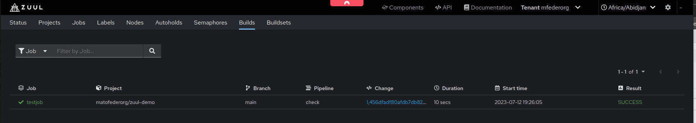

# Zuul-CI 

## Create VM on OpenStack

```bash
openstack network create zuul
openstack subnet create zuul --network zuul --subnet-range 10.1.0.0/24 --gateway 10.1.0.1 --allocation-pool start=10.1.0.100,end=10.1.0.200 --dns-nameserver 9.9.9.9
openstack router create zuul
openstack router set --external-gateway ext01 zuul
openstack router add subnet zuul zuul

openstack security group create allow-all
openstack security group rule create --remote-ip 0.0.0.0/0  allow-all

openstack server create --flavor SCS-2V:4:20 --image 'Ubuntu 22.04' --key-name mfeder --network zuul --security-group allow-all --security-group default zuul
TODO: add floating IP
```

### Access VM and install deps.

- Install Docker: https://docs.docker.com/engine/install/ubuntu/#install-using-the-repository
- Install other deps:
```bash
sudo apt-get install git docker-compose
```

## Deploy Zuul

Steps taken from:
- https://github.com/tibeerorg/zuul_setup_guide (most parts have been taken from here! Big thanks to Tim for his work!)
- https://zuul-ci.org/docs/zuul/latest/tutorials/quick-start.html
- https://zuul-ci.org/docs/zuul/latest/drivers/github.html#github

### Prepare GitHub APP

This tutorial sticks with the GitHub **APP** method and NOT the webhook method.
You can either create one for your organization or for your account.

1. Go to the settings of your account/organization
2. Select `Developer settings` on the left hand side
3. Select `GitHub Apps` on the left hand side
4. Select `New GitHub App` on the right hand side
5. Select a unique `GitHub App name`, e.g. ***zuulapp***
6. Select a dummy `Homepage URL` (this URL is opened when installing this app to a repository). I used ***https://www.google.com***
7. Set the `Webhook URL` to
   ```
   http://<zuul-hostname>:<port>/api/connection/<connection-name>/payload
   ```
   where
   - `zuul-hostname` is the IP or DNS name of your server
   - `port` is the Zuul port (typically ***9000***)
   - `connection-name` is the name you will later set in your zuul configuration. In this case I use ***github***
   for example: `http://213.131.230.109:9000/api/connection/github/payload`
8. Set the `Webhook secret` to a value of your choice and save it for later. I'll use ***wekhooksecretvalue***
9. Select the following `Repository persmissions`:
   | Permission        | Access           |
   |-------------------|------------------|
   | *Administration*  | **Read-only**    |
   | *Checks*          | **Read & write** |
   | *Contents*        | **Read & write** |
   | *Issues*          | **Read & write** |
   | *Pull requests*   | **Read & write** |
   | *Commit statuses* | **Read & write** |
10. Select the events you whish to subscribe to:
  - *Check run*
  - *Commit comment*
  - *Create*
  - *Issue comment*
  - *Issues*
  - *Label*
  - *Pull request*
  - *Pull request review*
  - *Pull request review comment*
  - *Push*
  - *Release*
  - *Status*
11. Select `Where can this GitHub App be installed?` to ***Only on this account***
12. Click on `Create GitHub App`
13. Save also the `App ID` for later (in our case ***360352***)
14. Scroll down to `Private keys` and click ***Generate a private key***
15. Save the received *pem* file for later
16. Install the GitHub app to your wished repositories / accounts / repositories by clicking on `Install App` on the left hand side.
    - It is necessary to do that to finish GitHub APP installation!

Note: sometimes it might happen that GitHub does not save your `Webhook secret`. Just re-enter it and save it again.

### Prepare Zuul config (on your Zuul VM)

Clone the example repository
```sh
git clone https://opendev.org/zuul/zuul
```

Replace all content with the equivalent content below.
Note the name of the `source` stanza matches your connection name you put earlier in the `Webhook URL`.
Note that at least the `config-projects` GitHub repositories need to exist before
you start your Zuul services. You may use the one from this organization, see https://github.com/matofederorg/zuul-config

This example `zuul-config` contains `base` job that runs some pre- / post-runs to provide more visibility.
Pre run role `validate-host` requires `ip` command on the worker node. This `ip` command is not installed in 
the worker node Dockerfile: *~/zuul/doc/source/examples/node-Dockerfile*.
Patch this file if you want to use provided `base` job:

```bash
sed -i.bak '/.*rsync.*/a \        iproute2 \\' ~/zuul/doc/source/examples/node-Dockerfile
```

I would suggest to clone it to your account/organization (then you will also be able to set the log server).

The *opendev.org* connection is highly recommended. The base jobs are based on this job collection.
By defining *include* you can restrict zuul to only load jobs and not something like pipelines.

*~/zuul/doc/source/examples/etc_zuul/main.yaml*
```yaml
- tenant:
    name: mfederorg       
    source:
      github:
        config-projects:
          - matofederorg/zuul-config:
              load-branch: main
        untrusted-projects:
          - matofederorg/zuul-demo
      opendev.org:
        untrusted-projects:
          - zuul/zuul-jobs:
              include:
                - job
```

Throw away all "connection" sections and replace all of them with these new two.
Note, that you need to insert your `webhook_token` and `app_id` values you saved
earlier. Also note that your connection name needs to match the name you put earlier
in the `Webhook URL`. Otherwise, you won't get a connection.

*~/zuul/doc/source/examples/etc_zuul/zuul.conf*
```ini
[connection "github"]
driver=github
webhook_token=wekhooksecretvalue
app_id=360352
app_key=/etc/zuul/github.pem

[connection "opendev.org"]
name=opendev
driver=git
baseurl=https://opendev.org
```

The `github.pem` file is not there yet. Use the *pem* file you saved earlier and upload
it to your Zuul instance to this file: `~/zuul/doc/source/examples/etc_zuul/github.pem`

### Start zuul services (on your Zuul VM)

```sh
cd zuul/doc/source/examples
sudo -E docker-compose -p zuul-tutorial up -d
```

This might take a few minutes.

If everything goes well you should see a similar logs from `zuul-tutorial_scheduler_1`:
```text
2023-07-12T19:21:34+00:00 Wait for certs to be present
2023-07-12T19:21:39+00:00 Wait for mysql to start
2023-07-12T19:21:41+00:00 Wait for zuul user to be created
2023-07-12 19:23:20,008 INFO zuul.SQLConnection: Initializing SQL connection database (prefix: )
2023-07-12 19:23:20,169 INFO zuul.Component: Registering component in ZooKeeper /zuul/components/scheduler/91ab2f5e6994
2023-07-12 19:23:20,186 INFO zuul.ComponentRegistry: Noticed new scheduler component 91ab2f5e69940000000000
2023-07-12 19:23:20,188 INFO zuul.ComponentRegistry: Component scheduler 91ab2f5e69940000000000 updated: {'hostname': '91ab2f5e6994', 'kind': 'scheduler', 'mo
del_api': 13, 'state': 'stopped', 'version': '8.3.2.dev47 266a98cdd'}
2023-07-12 19:23:20,194 INFO zuul.ComponentRegistry: Noticed new executor component 320272e86c380000000000
2023-07-12 19:23:20,196 INFO zuul.ComponentRegistry: Component executor 320272e86c380000000000 updated: {'accepting_work': True, 'allow_unzoned': True, 'hostn
ame': '320272e86c38', 'kind': 'executor', 'model_api': 13, 'process_merge_jobs': True, 'state': 'running', 'version': '8.3.2.dev47 266a98cdd', 'zone': None}
2023-07-12 19:23:20,209 INFO zuul.ComponentRegistry: Noticed new web component 862b0849d7a70000000000
2023-07-12 19:23:20,210 INFO zuul.ComponentRegistry: Component web 862b0849d7a70000000000 updated: {'hostname': '862b0849d7a7', 'kind': 'web', 'model_api': 13
, 'state': 'initializing', 'version': '8.3.2.dev47 266a98cdd'}
2023-07-12 19:23:20,211 INFO zuul.ComponentRegistry: System minimum data model version 13; this component 13
2023-07-12 19:23:20,271 INFO zuul.TimerDriver: Running timer election
2023-07-12 19:23:20,307 INFO alembic.runtime.migration: Context impl MySQLImpl.
2023-07-12 19:23:20,307 INFO alembic.runtime.migration: Context impl MySQLImpl.
2023-07-12 19:23:20,309 INFO alembic.runtime.migration: Will assume non-transactional DDL.
2023-07-12 19:23:20,309 INFO alembic.runtime.migration: Will assume non-transactional DDL.
2023-07-12 19:23:20,316 INFO zuul.nodepool: Watching nodepool requests
2023-07-12 19:23:20,317 INFO zuul.TimerDriver: Won timer election
2023-07-12 19:23:20,332 INFO alembic.runtime.migration: Context impl MySQLImpl.
2023-07-12 19:23:20,332 INFO alembic.runtime.migration: Context impl MySQLImpl.
2023-07-12 19:23:20,332 INFO alembic.runtime.migration: Will assume non-transactional DDL.
2023-07-12 19:23:20,332 INFO alembic.runtime.migration: Will assume non-transactional DDL.
2023-07-12 19:23:20,373 INFO zuul.GithubConnection: Starting GitHub connection: github
2023-07-12 19:23:20,373 INFO zuul.GithubConnection.GithubClientManager: Authing to GitHub
2023-07-12 19:23:21,284 INFO zuul.GithubConnection: Starting event connector
2023-07-12 19:23:21,291 INFO zuul.Scheduler: Starting scheduler
2023-07-12 19:23:21,320 INFO zuul.ComponentRegistry: Component scheduler 91ab2f5e69940000000000 updated: {'hostname': '91ab2f5e6994', 'kind': 'scheduler', 'mo
del_api': 13, 'state': 'initializing', 'version': '8.3.2.dev47 266a98cdd'}
2023-07-12 19:23:21,322 INFO zuul.Scheduler: Priming scheduler config
2023-07-12 19:23:21,339 INFO zuul.Scheduler: Creating initial system config
2023-07-12 19:23:21,339 INFO zuul.ConfigLoader: Loading configuration from /etc/zuul/main.yaml
2023-07-12 19:23:21,384 INFO zuul.KeyStorage: Generating a new secrets key for github/matofederorg/zuul-config
2023-07-12 19:23:21,386 INFO zuul.KeyStorage: Generating a new secrets key for opendev.org/zuul/zuul-jobs
2023-07-12 19:23:21,395 INFO zuul.KeyStorage: Generating a new secrets key for github/matofederorg/zuul-demo
2023-07-12 19:23:22,294 INFO zuul.KeyStorage: Generating a new SSH key for opendev.org/zuul/zuul-jobs
2023-07-12 19:23:22,736 INFO zuul.KeyStorage: Generating a new SSH key for github/matofederorg/zuul-demo
2023-07-12 19:23:23,378 INFO zuul.KeyStorage: Generating a new SSH key for github/matofederorg/zuul-config
2023-07-12 19:23:23,637 INFO zuul.GithubConnection: Got branches for matofederorg/zuul-config
2023-07-12 19:23:23,706 INFO zuul.GithubConnection: Got branches for matofederorg/zuul-demo
2023-07-12 19:23:24,003 INFO zuul.GithubConnection: Got merge modes for matofederorg/zuul-demo
2023-07-12 19:23:25,197 INFO zuul.GithubConnection: Got merge modes for matofederorg/zuul-config
2023-07-12 19:23:27,583 INFO zuul.TenantParser: Loading configuration from matofederorg/zuul-config/zuul.d/jobs.yaml@main
2023-07-12 19:23:27,585 INFO zuul.TenantParser: Loading configuration from matofederorg/zuul-config/zuul.d/pipelines.yaml@main
2023-07-12 19:23:27,589 INFO zuul.TenantParser: Loading configuration from matofederorg/zuul-config/zuul.d/projects.yaml@main
2023-07-12 19:23:29,382 INFO zuul.TenantParser: Loading configuration from matofederorg/zuul-demo/.zuul.yaml@zuul
2023-07-12 19:23:32,836 INFO zuul.TenantParser: Loading configuration from zuul/zuul-jobs/zuul.d/container-jobs.yaml@master
2023-07-12 19:23:32,838 INFO zuul.TenantParser: Loading configuration from zuul/zuul-jobs/zuul.d/docker-jobs.yaml@master
2023-07-12 19:23:32,839 INFO zuul.TenantParser: Loading configuration from zuul/zuul-jobs/zuul.d/general-jobs.yaml@master
2023-07-12 19:23:32,842 INFO zuul.TenantParser: Loading configuration from zuul/zuul-jobs/zuul.d/go-jobs.yaml@master
2023-07-12 19:23:32,843 INFO zuul.TenantParser: Loading configuration from zuul/zuul-jobs/zuul.d/haskell-jobs.yaml@master
2023-07-12 19:23:32,844 INFO zuul.TenantParser: Loading configuration from zuul/zuul-jobs/zuul.d/helm-jobs.yaml@master
2023-07-12 19:23:32,846 INFO zuul.TenantParser: Loading configuration from zuul/zuul-jobs/zuul.d/js-jobs.yaml@master
2023-07-12 19:23:32,848 INFO zuul.TenantParser: Loading configuration from zuul/zuul-jobs/zuul.d/nim-jobs.yaml@master
2023-07-12 19:23:32,849 INFO zuul.TenantParser: Loading configuration from zuul/zuul-jobs/zuul.d/packer-jobs.yaml@master
2023-07-12 19:23:32,850 INFO zuul.TenantParser: Loading configuration from zuul/zuul-jobs/zuul.d/python-jobs.yaml@master
2023-07-12 19:23:32,856 INFO zuul.TenantParser: Loading configuration from zuul/zuul-jobs/zuul.d/system-jobs.yaml@master
2023-07-12 19:23:32,857 INFO zuul.TenantParser: Loading configuration from zuul/zuul-jobs/zuul.d/terraform-jobs.yaml@master
2023-07-12 19:23:33,134 ERROR zuul.Pipeline.mfederorg.check: Exception loading ZKObject <zuul.model.PipelineState object at 0x7fc5501333d0> at /zuul/tenant/mf
ederorg/pipeline/check
2023-07-12 19:23:33,135 WARNING zuul.Pipeline.mfederorg.check: Initializing pipeline state for check; this is expected only for new pipelines
2023-07-12 19:23:33,155 ERROR zuul.Pipeline.mfederorg.check: Exception loading ZKObject <zuul.model.PipelineChangeList object at 0x7fc5501cca50> at /zuul/tena
nt/mfederorg/pipeline/check/change_list
2023-07-12 19:23:33,156 WARNING zuul.Pipeline.mfederorg.check: Initializing pipeline change list for check; this is expected only for new pipelines
2023-07-12 19:23:33,200 ERROR zuul.Pipeline.mfederorg.gate: Exception loading ZKObject <zuul.model.PipelineState object at 0x7fc550131b10> at /zuul/tenant/mfe
derorg/pipeline/gate
2023-07-12 19:23:33,202 WARNING zuul.Pipeline.mfederorg.gate: Initializing pipeline state for gate; this is expected only for new pipelines
2023-07-12 19:23:33,209 ERROR zuul.Pipeline.mfederorg.gate: Exception loading ZKObject <zuul.model.PipelineChangeList object at 0x7fc550131e50> at /zuul/tenan
t/mfederorg/pipeline/gate/change_list
2023-07-12 19:23:33,210 WARNING zuul.Pipeline.mfederorg.gate: Initializing pipeline change list for gate; this is expected only for new pipelines
2023-07-12 19:23:33,239 ERROR zuul.Pipeline.mfederorg.post: Exception loading ZKObject <zuul.model.PipelineState object at 0x7fc550252950> at /zuul/tenant/mfe
derorg/pipeline/post
:
```

Hence, above ERRORs and WARNINGs seem to be expected.

You should now be able to access your Zuul installation by directing your
browser to the IP address or DNS name of your server followed by the port (typically ***9000***)

Now create a PR in your demo repository, and you should see that your `testjob` passed:


If you want to trigger the job again add comment `recheck` into your PR:
https://github.com/matofederorg/zuul-demo/pull/1

### Check the connection (on your machine)

Go back to your GitHub app settings:
1. Open the `Settings`
2. Click on `Installed GitHub Apps` on the left hand side
3. Click `Configure` on the right hand side
4. Click `App settings` on the top
5. Click `Advanced` on the left hand side
6. Check if the top entry has a green tick (if not, click on ***Redeliver***)
